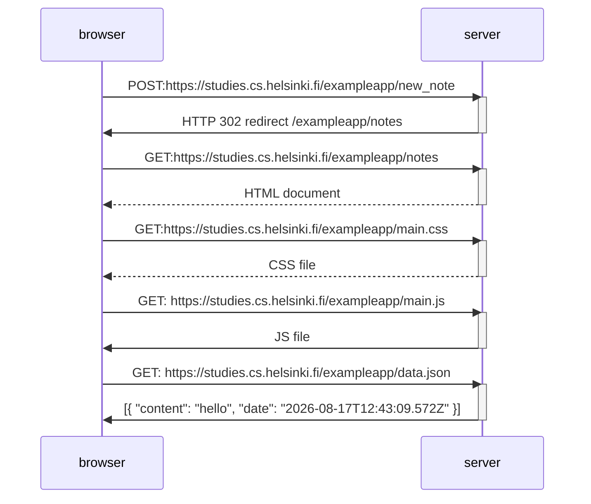

```mermaid
sequenceDiagram

    participant browser
    participant server

    browser->>server: POST:https://studies.cs.helsinki.fi/exampleapp/new_note
    activate server
    server->>browser: HTTP 302 redirect /exampleapp/notes
    deactivate server

    browser->>server: GET:https://studies.cs.helsinki.fi/exampleapp/notes
    activate server
    server-->>browser: HTML document
    deactivate server

    browser->>server: GET:https://studies.cs.helsinki.fi/exampleapp/main.css
    activate server
    server-->>browser: CSS file
    deactivate server

    browser->>server: GET: https://studies.cs.helsinki.fi/exampleapp/main.js
    activate server
    server->>browser: JS file
    deactivate server

    browser->>server: GET: https://studies.cs.helsinki.fi/exampleapp/data.json
    activate server
    server->>browser: [{ "content": "hello", "date": "2026-08-17T12:43:09.572Z" }]
    deactivate server
```
