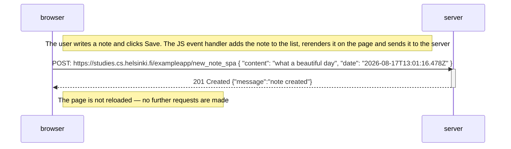

```mermaid
sequenceDiagram

    participant browser
    participant server

    Note right of browser: The user writes a note and clicks Save. The JS event handler adds the note to the list, rerenders it on the page and sends it to the server

    browser->>server: POST: https://studies.cs.helsinki.fi/exampleapp/new_note_spa { "content": "what a beautiful day", "date": "2026-08-17T13:01:16.478Z" }
    activate server
    server-->>browser: 201 Created {"message":"note created"}
    deactivate server

    Note right of browser: The page is not reloaded — no further requests are made
```
